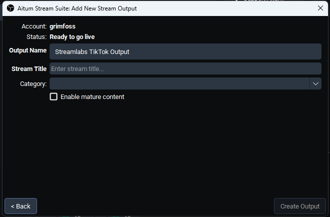

# Aitum Stream Suite — Streamlabs TikTok Fork

OBS Studio plugin providing per-output stream management, forked from [Aitum Stream Suite](https://github.com/Aitum/obs-aitum-stream-suite).

## Requirements

- **OBS Studio 31.1.0 or newer**
- **A free Streamlabs account** that's connected to a TikTok account eligible for live streaming



## What This Does

- **Log in with Streamlabs** — authenticates right from OBS using your browser
- **Auto-fetches your TikTok stream key** — no more copying and pasting keys every time you go live
- **Auto-starts your TikTok stream** when you hit "Start Streaming" in OBS
- **Auto-ends your TikTok stream** when you stop — cleanup happens automatically
- **Pick your stream category** — search and choose the game/category for your TikTok stream
- **Manual "End Stream" button** — a fallback on the config page if you need to end a TikTok stream that didn't stop cleanly

No need to leave OBS, no external tools, no manual key rotation.

### ⚠️ Disclaimer

**This plugin uses undocumented Streamlabs internal API endpoints** (`/api/v5/slobs/tiktok/*`). These endpoints are consumed by the official Streamlabs Desktop application and are **not a public API**. There is **no guarantee** they will remain stable. If Streamlabs changes or removes these endpoints, this plugin will stop working and there is little that can be done beyond finding a new approach.

Use at your own risk.

### Credits

The OAuth PKCE flow and API interaction pattern are based on the work of **Loukious**'s [`StreamLabsTikTokStreamKeyGenerator`](https://github.com/Loukious/StreamLabsTikTokStreamKeyGenerator) Python script — thank you for reverse-engineering the flow.

## Building

Requires:
- CMake 3.16+
- Visual Studio 2022 Build Tools (or full VS)
- Windows SDK 10.0.20348+

```powershell
cmake --preset windows-x64
cmake --build build_x64 --config RelWithDebInfo
```

The built plugin (`aitum-stream-suite.dll`) and locale file will be under `build_x64/RelWithDebInfo/`.

## Installation

### Manual

| File | Destination |
|------|-------------|
| `build_x64/RelWithDebInfo/aitum-stream-suite.dll` | `C:\Program Files\obs-studio\obs-plugins\64bit\` |
| `data/locale/en-US.ini` | `C:\Program Files\obs-studio\data\obs-plugins\aitum-stream-suite\locale\` |

### Installer

Download the latest `aitum-stream-suite-*-windows-installer.exe` from [Releases](https://github.com/grimfoss/obs-aitum-stream-suite/releases) and run it. The installer will detect your OBS installation and handle everything.

## License

Same as upstream — [GNU General Public License v2.0](LICENSE).
